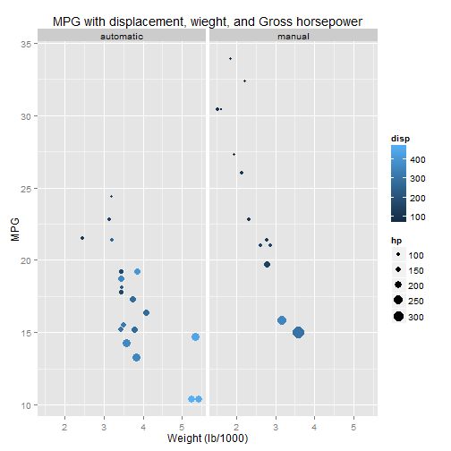
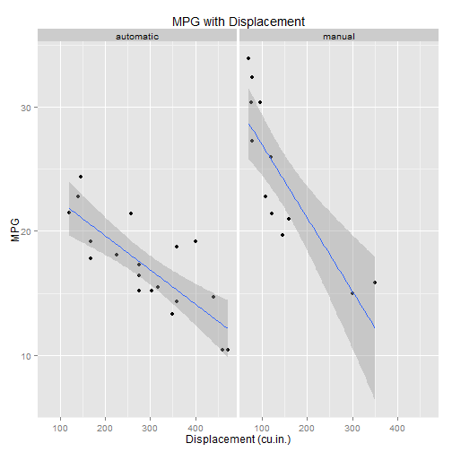
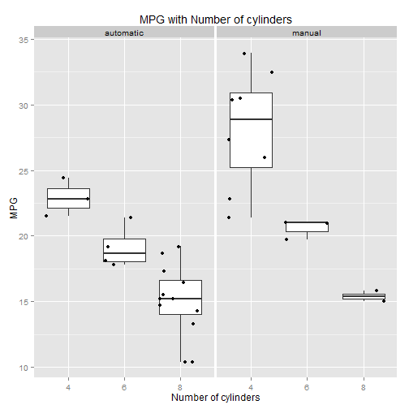
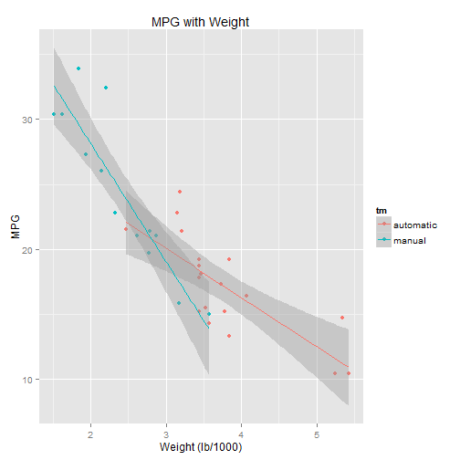
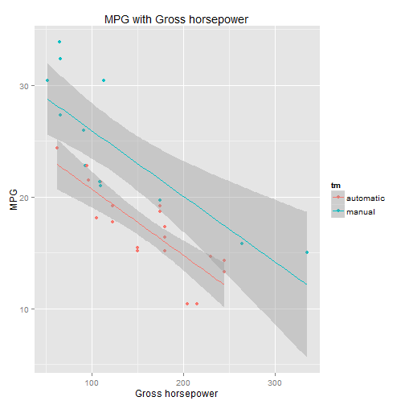
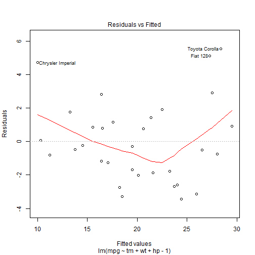
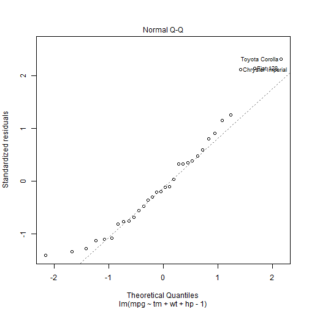
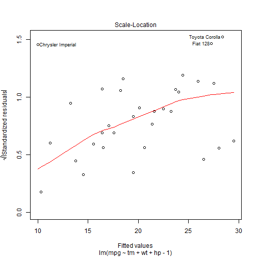
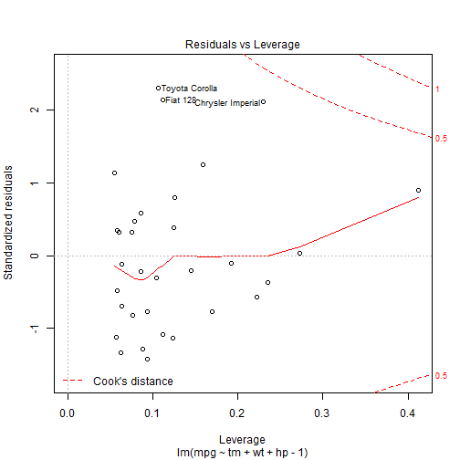

Effict of Transmission Type on MPG
====

## Introduction

In this report aim to explore the relationship between set of variables and miles per gallon (MPG) (outcome).

#### Data Processing

Some data has to be prepared

```r
library(ggplot2)
data(mtcars)

mcars <- mtcars
mcars[mcars$am == 0, c("tm")] <- gsub("0", "automatic", mcars[mcars$am == 0, 
    c("am")])
mcars[mcars$am == 1, c("tm")] <- gsub("1", "manual", mcars[mcars$am == 1, c("am")])
mcars$tm <- as.factor(mcars$tm)

auto <- subset(mcars, am == 0)
manual <- subset(mcars, am == 1)
```


#### variables correlation 

First we take a look at variables correlation with MPG column


```r
sort(abs(cor(mtcars)[, c("mpg")]), decreasing = T)
```

```
##    mpg     wt    cyl   disp     hp   drat     vs     am   carb   gear 
## 1.0000 0.8677 0.8522 0.8476 0.7762 0.6812 0.6640 0.5998 0.5509 0.4803 
##   qsec 
## 0.4187
```


## Exploratory Analysis

Exploratory Analysis had been done and showed relations between variables Check the appendix


## Model selection

Attempt to fit a model with the most correlated variables


```r
carsfit <- lm(mpg ~ tm + as.factor(cyl) + wt + disp + hp - 1, data = mcars)
summary(carsfit)
```

```
## 
## Call:
## lm(formula = mpg ~ tm + as.factor(cyl) + wt + disp + hp - 1, 
##     data = mcars)
## 
## Residuals:
##    Min     1Q Median     3Q    Max 
##  -3.94  -1.33  -0.39   1.19   5.08 
## 
## Coefficients:
##                 Estimate Std. Error t value Pr(>|t|)    
## tmautomatic     33.86428    2.69542   12.56  2.7e-12 ***
## tmmanual        35.67038    2.12210   16.81  3.9e-15 ***
## as.factor(cyl)6 -3.13607    1.46909   -2.13    0.043 *  
## as.factor(cyl)8 -2.71778    2.89815   -0.94    0.357    
## wt              -2.73869    1.17598   -2.33    0.028 *  
## disp             0.00409    0.01277    0.32    0.751    
## hp              -0.03248    0.01398   -2.32    0.029 *  
## ---
## Signif. codes:  0 '***' 0.001 '**' 0.01 '*' 0.05 '.' 0.1 ' ' 1 
## 
## Residual standard error: 2.45 on 25 degrees of freedom
## Multiple R-squared: 0.989,	Adjusted R-squared: 0.986 
## F-statistic:  330 on 7 and 25 DF,  p-value: <2e-16
```


Now We Exclude Number of Cylenders and dispalcement variables because they are not statistically segnificant.

and fit a model with significant values.


```r
carsfit <- lm(mpg ~ tm + wt + hp - 1 + tm * wt * hp, data = mcars)
summary(carsfit)
```

```
## 
## Call:
## lm(formula = mpg ~ tm + wt + hp - 1 + tm * wt * hp, data = mcars)
## 
## Residuals:
##    Min     1Q Median     3Q    Max 
## -2.786 -1.594  0.056  1.136  4.914 
## 
## Coefficients:
##                Estimate Std. Error t value Pr(>|t|)    
## tmautomatic     40.3272    13.0082    3.10   0.0049 ** 
## tmmanual        53.1642     5.7501    9.25  2.2e-09 ***
## wt              -4.7968     4.0017   -1.20   0.2423    
## hp              -0.0888     0.0647   -1.37   0.1828    
## tmmanual:wt     -5.3620     4.5974   -1.17   0.2550    
## tmmanual:hp     -0.0326     0.0889   -0.37   0.7174    
## wt:hp            0.0145     0.0192    0.75   0.4577    
## tmmanual:wt:hp   0.0178     0.0261    0.68   0.5029    
## ---
## Signif. codes:  0 '***' 0.001 '**' 0.01 '*' 0.05 '.' 0.1 ' ' 1 
## 
## Residual standard error: 2.21 on 24 degrees of freedom
## Multiple R-squared: 0.992,	Adjusted R-squared: 0.989 
## F-statistic:  357 on 8 and 24 DF,  p-value: <2e-16
```


But that didn't worked, it has many many insignificant values.

So, let's try it with less details.


```r
carsfit <- lm(mpg ~ tm + wt + hp - 1, data = mcars)
summary(carsfit)
```

```
## 
## Call:
## lm(formula = mpg ~ tm + wt + hp - 1, data = mcars)
## 
## Residuals:
##    Min     1Q Median     3Q    Max 
## -3.422 -1.792 -0.379  1.225  5.532 
## 
## Coefficients:
##             Estimate Std. Error t value Pr(>|t|)    
## tmautomatic 34.00288    2.64266   12.87  2.8e-13 ***
## tmmanual    36.08659    1.73634   20.78  < 2e-16 ***
## wt          -2.87858    0.90497   -3.18  0.00357 ** 
## hp          -0.03748    0.00961   -3.90  0.00055 ***
## ---
## Signif. codes:  0 '***' 0.001 '**' 0.01 '*' 0.05 '.' 0.1 ' ' 1 
## 
## Residual standard error: 2.54 on 28 degrees of freedom
## Multiple R-squared: 0.987,	Adjusted R-squared: 0.985 
## F-statistic:  538 on 4 and 28 DF,  p-value: <2e-16
```


Now we got a sutable model.


## Conclusion

#### The Answer

From the model we can say that manual transmission cars are little bit better for MPG by an average of  **2.0837** miled per US galon.

#### Model Uncertainty

The model used is very statistically significant one, with 0.9853 Adjusted R-squared. the data given is too small data and that is why we couldn't build a model with more details and variables.


## Appendix

### Exploratory analysis Plots 


```r
qplot(y = mpg, x = wt, data = mcars, colour = disp, size = hp, facets = . ~ 
    tm, geom = c("point"), ylab = "MPG", xlab = "Weight (lb/1000)", main = "MPG with displacement, wieght, and Gross horsepower")
```

 

```r

qplot(y = mpg, x = disp, data = mcars, facets = . ~ tm, geom = c("point", "smooth"), 
    method = "lm", main = "MPG with Displacement", ylab = "MPG", xlab = "Displacement (cu.in.)")
```

 

```r

qplot(y = mpg, x = as.factor(cyl), data = mcars, geom = c("boxplot", "jitter"), 
    facets = . ~ tm, main = "MPG with Number of cylinders", ylab = "MPG", xlab = "Number of cylinders")
```

 

```r

qplot(y = mpg, x = wt, data = mcars, color = tm, geom = c("point", "smooth"), 
    method = "lm", main = "MPG with Weight", ylab = "MPG", xlab = "Weight (lb/1000)")
```

 

```r

qplot(y = mpg, x = hp, data = mcars, color = tm, geom = c("point", "smooth"), 
    method = "lm", main = "MPG with Gross horsepower", ylab = "MPG", xlab = "Gross horsepower")
```

 


### Rsiduals


```r
plot(carsfit)
```

    

